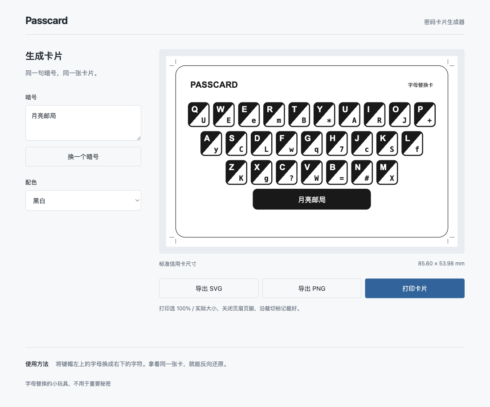

# Passcard

一个单文件的字母替换卡片生成器。

下载 [passcard.html](https://github.com/VaneEcho/passcard/raw/refs/heads/main/passcard.html)，用浏览器打开。不用安装，也不用联网。

写一句暗号，挑个配色，生成卡片。照着键帽替换字母，拿着同一张卡就能反向还原。

可以导出 SVG、PNG，或直接打印。打印选 **100% / 实际大小**，沿标记裁切，就是标准信用卡大小（85.60 × 53.98 mm）。

字母替换的小玩具，不用于重要秘密。
